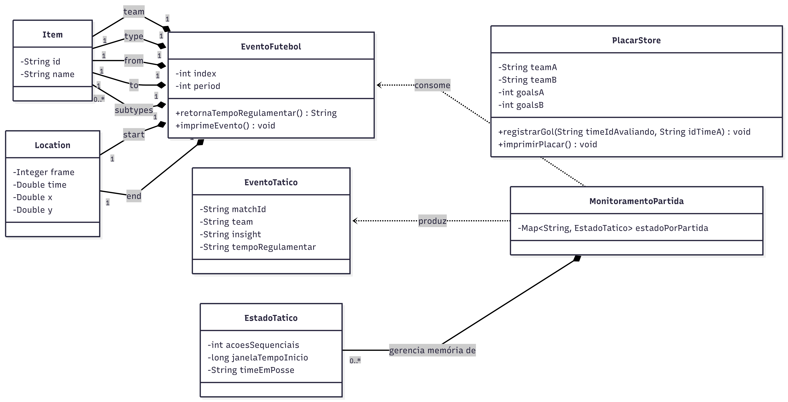

# Monitoramento de Partidas de Futebol em Tempo Real com Apache Kafka

Este projeto foi desenvolvido para a disciplina de **Sistemas Orientados a Eventos** na Universidade Federal do Espírito Santo (UFES). O sistema implementa um pipeline de **Processamento de Eventos Complexos (CEP)** para monitorar eventos táticos de futebol em tempo real, utilizando uma arquitetura distribuída e escalável baseada em microsserviços.

**Grupo:** Gustavo Penna & Rafael Rodrigues

---

# Descrição do Domínio

O sistema consome dados brutos no padrão **EPTS (Electronic Performance and Tracking Systems)** da FIFA. Estes dados consistem em eventos primitivos (passes, finalizações, cartões, etc.) enriquecidos com coordenadas espaciais (X, Y) e de tempo.

O objetivo central é transformar este fluxo de dados em **Insights Táticos**, como a identificação de "Pressão ofensiva", através de um motor de processamento que mantém o estado da partida em memória.

---

# Arquitetura do Sistema

O sistema segue uma topologia de streaming em múltiplos estágios:

1. **Produtor:** Injeta eventos JSON no tópico `match-events-raw`, utilizando o `matchId` como chave para garantir a ordem cronológica por partida.
2. **MonitoramentoPartida (Stream Processor):** Atua como um *Consumer-Producer*. Consome os dados brutos, aplica lógica tática com estado e produz alertas para o tópico `match-insight`.
3. **Consumidores:** Microsserviços independentes que reagem aos eventos processados (Placar, Cartões, Finalizações e Insights de Pressão).

# Diagrama de Domínio


# Guia de Execução
## 1. Subir a Infraestrutura (Docker)

 Iniciar o cluster Kafka (Brokers e Zookeeper)
```bash
docker compose up -d
```

Verificar se os containers estão ativos
```bash
docker compose ps
```
## 2. Configurar os Tópicos

Cria tópicos match-events-raw e match-insight
```bash
docker exec -it kafka-1 /opt/kafka/bin/kafka-topics.sh --create --topic match-events-raw --partitions 3 --replication-factor 2 --bootstrap-server localhost:9092

docker exec -it kafka-1 /opt/kafka/bin/kafka-topics.sh --create --topic match-insight --partitions 1 --replication-factor 2 --bootstrap-server localhost:9092
```

## 3. Ordem de execução das aplicaçõs Java

Para observar o comportamento do sistema, execute na seguinte ordem:

1. Inicie todos os Consumidores e o MonitoramentoPartida.
```bash
mvn exec:java -Dexec.mainClass="br.ufes.inf.ConsumerPlacar"
```
```bash
mvn exec:java -Dexec.mainClass="br.ufes.inf.ConsumerFinalizacao"
```
```bash
mvn exec:java -Dexec.mainClass="br.ufes.inf.ConsumerCartao"
```
```bash
mvn exec:java -Dexec.mainClass="br.ufes.inf.ConsumerPressao"
```
```bash
mvn exec:java -Dexec.mainClass="br.ufes.inf.MonitoramentoPartida"
```
2. Inicie o Producer para disparar o fluxo de dados.
```bash
mvn exec:java -Dexec.mainClass="br.ufes.inf.Producer"
```

## 4. Comandos de Monitorização e Debug

Visualizar todos os grupos:
```bash
docker exec -it kafka-1 /opt/kafka/bin/kafka-consumer-groups.sh --bootstrap-server localhost:9092 --list
```

Descrever estado de um grupo específico:

- Placar:
```bash
docker exec -it kafka-1 /opt/kafka/bin/kafka-consumer-groups.sh --bootstrap-server localhost:9092 --describe --group placar-group
```
- Finalizações:
```bash
docker exec -it kafka-1 /opt/kafka/bin/kafka-consumer-groups.sh --bootstrap-server localhost:9092 --describe --group shots-group
```
- Cartões:
```bash
docker exec -it kafka-1 /opt/kafka/bin/kafka-consumer-groups.sh --bootstrap-server localhost:9092 --describe --group cards-group
```

## Reset de Ambiente

Apagar tópicos:
```bash
docker exec -it kafka-1 /opt/kafka/bin/kafka-topics.sh --bootstrap-server localhost:9092 --delete --topic match-events-raw

docker exec -it kafka-1 /opt/kafka/bin/kafka-topics.sh --bootstrap-server localhost:9092 --delete --topic match-insight
```
Resetar Offsets (sem apagar dados):
```bash
docker exec -it kafka-1 /opt/kafka/bin/kafka-consumer-groups.sh --bootstrap-server local
```